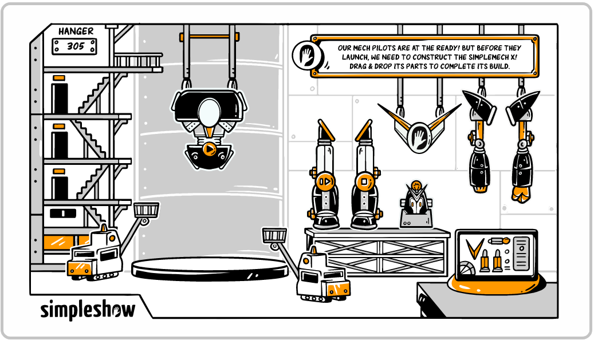
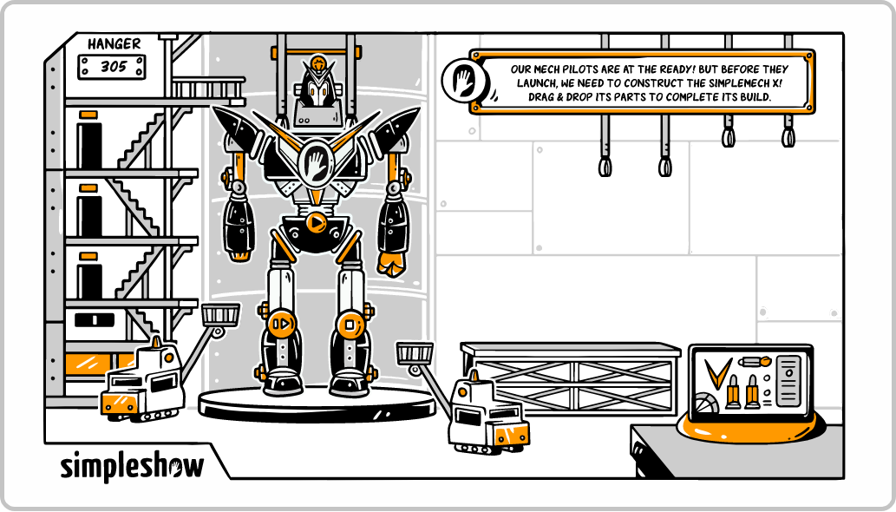

# Drag and Drop

## Comenzando :rocket:

Estas instrucciones te permitirán obtener una copia del proyecto en funcionamiento en tu máquina local para propósitos de desarrollo.

### Pre-requisitos :pencil:

Que cosas necesitas para correr el **Proyecto**:

* webpack instalado.
* Tener configurado webpack.
  * Tener el archivo ``.babelrc``.
  * Tener el archivo ``webpack.config.js``.
* Tener las dependencias correspondientes instaladas.

### Instalación :wrench:

En el directorio del proyecto, puede ejecutar:

#### ``npm install``

Ejecuta la aplicación en modo de desarrollo.
#### ``npm start``
Abra _**http://localhost:3100**_ para verlo en el navegador.

### Tecnologias y lenguajes en lo que esta hecho :computer:

1. webpack.
2. javascript.
   * ECMAScript 6.
3. html.
4. sass. 

### Imagenes del proyecto :flower_playing_cards:

  

### Autor [:octocat:](https://github.com/OmarVargas235)

**_Omar Vargas_**
